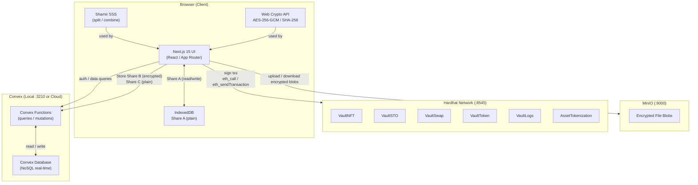
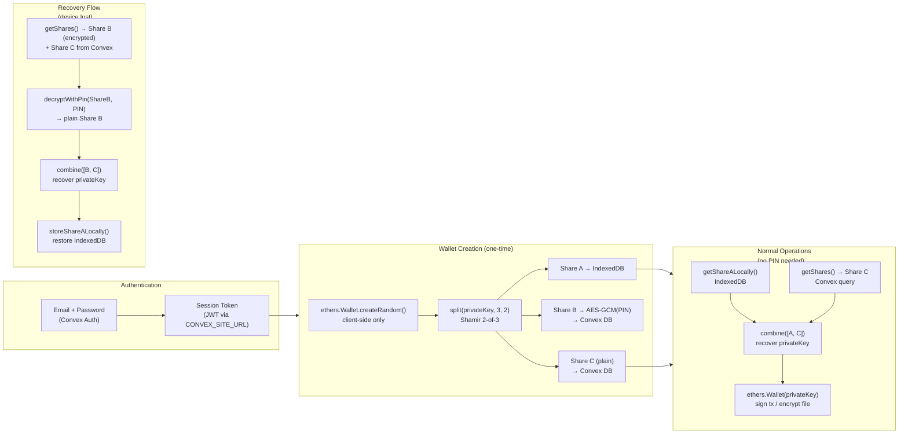

# Vault DAO — Local Development Installation Guide

A full-stack decentralized vault platform combining **Next.js 15**, **Convex** (local self-hosted or cloud), and a local **Hardhat blockchain** with Shamir-based client-side key management.

> ⚠ **MVP — Read Before Using in Production**
>
> This is a **Minimum Viable Product** for local development and evaluation. Several components are intentionally simplified and **must be hardened before any real-world deployment**. Key limitations are called out throughout this guide and summarised in [Section 9 — Production Checklist](#9-production-checklist).

> **TL;DR** — three scripts, three terminals, in order:
> ```bash
> bun install                  # once, from project root
> ./run_backend.sh             # Terminal 1 — Convex dev server (keep open)
> ./deploy_contracts.sh        # Terminal 2 — Hardhat + contracts + import (one-time)
> ./run_frontend.sh            # Terminal 3 — Next.js dev server
> ```

---

## Table of Contents

1. [Architecture Overview](#1-architecture-overview)
2. [Component Interaction Map](#2-component-interaction-map)
3. [Shamir Secret Sharing — Security Model](#3-shamir-secret-sharing--security-model)
4. [Prerequisites](#4-prerequisites)
5. [Installation — Step by Step](#5-installation--step-by-step)
   - [5.1 Clone & Install Dependencies](#51-clone--install-dependencies)
   - [5.2 Terminal 1 — Convex Backend (`run_backend.sh`)](#52-terminal-1--convex-backend-run_backendsh)
   - [5.3 Terminal 2 — Deploy Contracts (`deploy_contracts.sh`)](#53-terminal-2--deploy-contracts-deploy_contractssh)
   - [5.4 Terminal 3 — Next.js Frontend (`run_frontend.sh`)](#54-terminal-3--nextjs-frontend-run_frontendsh)
6. [Service URLs](#6-service-urls)
7. [Blockchain Accounts (Hardhat)](#7-blockchain-accounts-hardhat)
8. [Troubleshooting](#8-troubleshooting)
9. [Production Checklist](#9-production-checklist)

---

## 1. Architecture Overview



---

## 2. Component Interaction Map

The diagram below traces a complete user flow — from login to signing a blockchain transaction.



### What lives where

| Data | Location | Encrypted? |
|---|---|---|
| Share A | Browser IndexedDB | Plain |
| Share B | Convex DB | ✅ AES-256-GCM (PIN-derived key) |
| Share C | Convex DB | Plain |
| Private Key | Never stored | Reconstructed in-memory only |
| File blobs | MinIO | ✅ AES-256-GCM (wallet-derived key) |
| Contract addresses | Convex DB (`smartContracts` table) | Plain |
| User profile / sessions | Convex DB | Plain |

---

## 3. Shamir Secret Sharing — Security Model

The wallet private key is **never** stored on any server in plain form. It is split into 3 shares using a **2-of-3 Shamir threshold scheme** (any 2 shares can reconstruct the key).

```
privateKey (32 bytes)
      │
      ▼
 split(secret, n=3, k=2)          ← shamirs-secret-sharing library
      │
      ├──── Share A ──► IndexedDB (browser local, plain)
      ├──── Share B ──► AES-256-GCM(PIN) → Convex DB
      └──── Share C ──────────────────── → Convex DB (plain)
```

**Normal operation**: `combine([A, C])` — instant, no PIN required.

**Recovery scenarios**:
- Lost device (no Share A): `combine([B_decrypted, C])` — requires PIN
- Lost PIN (same device): `combine([A, C])` — set a new PIN, re-encrypt Share B
- Database breach: attacker gets `C` (plain) + `B` (encrypted) — **useless without PIN**

PIN is never stored. Only `(encryptedShareB, IV, salt, SHA256(PIN))` are persisted.

> ⚠ **MVP Limitation — Wallet Recovery Responsibility**
>
> **Share A is stored only in the browser's IndexedDB.** This means:
> - Clearing browser data / cookies, switching browsers, or using a different device **removes Share A**.
> - The user **must recover their wallet using their PIN** (which decrypts Share B from the server) whenever Share A is missing.
> - Users should be clearly instructed to **remember their PIN** — it is the only way to recover the wallet on a new device. If both Share A is lost and the PIN is forgotten, the wallet is unrecoverable.
>
> ⚠ **MVP Limitation — Share Storage (Production Hardening Required)**
>
> In this MVP both Share B and Share C are stored in the same Convex database. For production:
> - **Share B** (PIN-encrypted) should remain in the primary database.
> - **Share C** should be moved to a separate, isolated store — ideally a **Hardware Security Module (HSM)** or a dedicated secrets vault (e.g. AWS CloudHSM, Azure Key Vault, HashiCorp Vault).
> - Storing both shares in the same database reduces the security benefit of the 2-of-3 scheme under a full database breach scenario.

---

## 4. Prerequisites

| Tool | Version | Install |
|---|---|---|
| Node.js | 20 LTS+ | https://nodejs.org or `nvm install 20` |
| Bun | 1.x | `curl -fsSL https://bun.sh/install \| bash` |

> **Why Bun?** Used as the package manager and runtime for both the frontend and blockchain tooling. npm/yarn will also work but the scripts use `bun`/`bunx` throughout.

Verify before starting:

```bash
node -v   # should print v20.x.x or higher
bun -v    # should print 1.x.x
```

If `node -v` shows a version below 20, install [nvm](https://github.com/nvm-sh/nvm) and run:

```bash
nvm install 20
nvm use 20
```

---

## 5. Installation — Step by Step

### 5.1 Clone & Install Dependencies

```bash
git clone <your-repo-url>
cd vault_convex_only
bun install
```

This installs all Next.js / Convex / frontend dependencies into `node_modules/`.

---

### 5.2 Terminal 1 — Convex Backend (`run_backend.sh`)

```bash
./run_backend.sh
```

This runs `bunx convex dev` which starts the Convex backend, deploys your functions, and watches for changes. **Leave this terminal open for your entire dev session.**

**On first run**, the CLI prompts you to choose a deployment type:

```
? Welcome to Convex! Would you like to login to your account?
❯ Start without an account (run Convex locally)
  Login or create an account
```

| Option | What happens |
|---|---|
| **Start without an account** | Convex runs fully locally. No account or Docker needed. Writes `NEXT_PUBLIC_CONVEX_URL=http://127.0.0.1:3210` to `.env.local`. Dashboard at `http://127.0.0.1:6790`. |
| **Login or create an account** | Authenticates with [dashboard.convex.dev](https://dashboard.convex.dev). Free tier. Dashboard at `https://dashboard.convex.dev`. |

Once you see `✔ Convex functions ready` the backend is running. Functions re-deploy automatically on every save.

> **Production / CI**: use `bunx convex deploy` (one-shot, exits after deploying) instead of `convex dev`.

---

### 5.3 Terminal 2 — Deploy Contracts (`deploy_contracts.sh`)

Run this **once** (and again any time Hardhat restarts, since contract addresses reset):

```bash
./deploy_contracts.sh
```

The script does everything in sequence:

1. Checks that Convex is reachable
2. Installs `blockchain/node_modules` if needed
3. Compiles all Solidity contracts via Hardhat
4. Starts the Hardhat node on **port 8545** (chainId 1337) in the background
5. Deploys all six contracts:

| Contract | Purpose |
|---|---|
| `VaultNFT` | Mint NFTs representing digital assets |
| `VaultToken` | ERC-20 governance/utility token (`vVault`) |
| `VaultSTO` | Security Token Offering (buy tokens with ETH) |
| `VaultSwap` | DEX-style ETH ↔ vVault swap (rate: 1 ETH = 1000 vVault) |
| `VaultLogs` | On-chain immutable audit trail |
| `AssetTokenization` | Real-world asset tokenization (real estate, art, etc.) |

6. Imports deployed addresses into the Convex `smartContracts` table from `blockchain/deployments/contracts.jsonl`

Addresses are also saved locally to `blockchain/deployments/contracts.json` and `contracts.jsonl`.

> ⚠ **MVP — Test Blockchain Only**
>
> The Hardhat Network is a **local test chain** (chainId 1337) with no real value. It resets every time the node restarts — all contracts and balances are lost.
>
> For production you must replace this with a real network:
> - **Private network**: Deploy a [Hyperledger Besu](https://besu.hyperledger.org) node or a [Geth](https://geth.ethereum.org) PoA network with proper validator management and persistent state.
> - **Public testnet**: Sepolia (Ethereum testnet) — suitable for pre-production testing with no real funds.
> - **Mainnet**: Ethereum mainnet or a compatible L2 (Polygon, Arbitrum, etc.) — requires real ETH for gas.

---

### 5.4 Terminal 3 — Next.js Frontend (`run_frontend.sh`)

```bash
./run_frontend.sh
```

Before starting Next.js, the script runs three one-time setup steps (each guarded by a sentinel file so they are skipped on subsequent runs):

**Step A — JWT Secrets**
1. Runs `node app/generate_secrets.mjs` to produce an RS256 key pair
2. Sets `JWT_PRIVATE_KEY`, `JWKS`, and `SITE_URL` in Convex — required for Convex Auth to sign and verify session tokens
3. Creates `.jwt_secrets_set` so keys are never regenerated automatically (regenerating invalidates all active sessions)

> To force key regeneration (logs out all users): `rm .jwt_secrets_set` then re-run the script.

**Step B — Payment Secrets (Polar)**

The script interactively prompts for the three Polar environment variables:

```
  POLAR_ORGANIZATION_TOKEN (or Enter to skip):
  POLAR_SERVER [sandbox/production] (or Enter to skip, defaults to sandbox):
  POLAR_WEBHOOK_SECRET (or Enter to skip):
```

| Variable | Description |
|---|---|
| `POLAR_ORGANIZATION_TOKEN` | Your Polar organisation API token |
| `POLAR_SERVER` | `sandbox` (testing) or `production` |
| `POLAR_WEBHOOK_SECRET` | Webhook signing secret from Polar dashboard |

Get these values from [polar.sh](https://polar.sh) → your organisation → Settings → API tokens / Webhooks.

> ⚠ **Polar webhooks require a publicly reachable Convex backend.**
>
> Polar sends webhook events (subscription created, payment succeeded, etc.) via HTTP POST to your Convex HTTP Actions endpoint. This means:
> - **Local Convex (`run_backend.sh`)**: webhooks will **not work** — `http://127.0.0.1:3210` is not reachable from the internet. Skip the Polar setup when running locally; payment features will be inactive.
> - **Cloud Convex**: webhooks work automatically. Deploy with `bunx convex deploy` against your cloud deployment and set `SITE_URL` to your production domain.
>
> For local webhook testing you can use a tunnel tool such as [ngrok](https://ngrok.com) or [Cloudflare Tunnel](https://developers.cloudflare.com/cloudflare-one/connections/connect-networks/) to expose your local Convex HTTP Actions port.

If you press Enter to skip, a warning is shown and payment features will be disabled. You can configure them later by deleting `.payment_secrets_set` and re-running the script.

**Step C — Start Next.js**

Runs `bun run dev` after both secret steps complete.

Open [http://localhost:3000](http://localhost:3000). On first run, create an account — you will also be prompted to set up a wallet (wallet creation happens entirely in the browser).

---

## 6. Service URLs

| Service | URL | Notes |
|---|---|---|
| Next.js App | http://localhost:3000 | — |
| Hardhat RPC | http://localhost:8545 | JSON-RPC (chainId 1337) |
| Convex Backend | http://127.0.0.1:3210 | Local mode only |
| Convex Dashboard | http://127.0.0.1:6790 | Local mode only |
| Convex Dashboard (cloud) | https://dashboard.convex.dev | Cloud mode |

---

## 7. Blockchain Accounts (Hardhat)

Hardhat uses a fixed test mnemonic. The first account is the deployer and is used to fund new user wallets during testing.

```
Mnemonic: test test test test test test test test test test test junk

Account #0: 0xf39Fd6e51aad88F6F4ce6aB8827279cffFb92266
Private Key: 0xac0974bec39a17e36ba4a6b4d238ff944bacb478cbed5efcae784d7bf4f2ff80
Balance: 10,000 ETH (test)
```

> These are **publicly known** test keys. Never use them on any real network.

To send test ETH to your in-app wallet, use the **"테스트 ETH 받기"** button on the My Wallet page — it sends 10 ETH from Account #0 to your wallet.

---

## 8. Troubleshooting

### Convex auth / login issues

If the Convex CLI prompts are interrupted or credentials expire, log out and restart:

```bash
bunx convex logout
./run_backend.sh
```

### Port 8545 already in use

`deploy_contracts.sh` reuses the existing node automatically. To kill it manually:

```bash
lsof -ti:8545 | xargs kill -9
```

### Convex functions out of date / schema mismatch

Restart `run_backend.sh` — it will re-deploy all functions and sync the schema.

### Smart contracts not found by frontend

The `smartContracts` table in Convex must have entries for `network: "localhost"` and `chainId: 1337`. Re-run `./deploy_contracts.sh` after every Hardhat restart — contract addresses reset on restart but are deterministic within a session.

### `.env.local` missing `NEXT_PUBLIC_CONVEX_URL`

`run_frontend.sh` will warn you if this is missing. It means `run_backend.sh` hasn't finished its first-run setup yet. Wait until you see `✔ Convex functions ready` in Terminal 1, then start the frontend.

### Auth not working / JWT errors

`JWT_PRIVATE_KEY` and `JWKS` must be set in Convex before the frontend starts — `run_frontend.sh` does this automatically. If you skipped the script and ran `bun run dev` directly, set them manually:

```bash
node app/generate_secrets.mjs
# copy the printed values, then:
bunx convex env set JWT_PRIVATE_KEY="<value>"
bunx convex env set JWKS="<value>"
```

To force regeneration (resets all sessions): `rm .jwt_secrets_set && ./run_frontend.sh`

### Payment not working / Polar errors

`run_frontend.sh` prompts for Polar credentials on first run. If you skipped them, set the variables manually:

```bash
bunx convex env set POLAR_ORGANIZATION_TOKEN="<value>"
bunx convex env set POLAR_SERVER="sandbox"
bunx convex env set POLAR_WEBHOOK_SECRET="<value>"
```

Get your credentials from [polar.sh](https://polar.sh) → your organisation → Settings → API tokens / Webhooks.

To re-run the interactive prompt: `rm .payment_secrets_set && ./run_frontend.sh`

### File name rules for Convex functions

Convex's bundler **does not allow hyphens** in function file names:

```
✅ activityLogs.ts
✅ walletShares.ts
✅ auth.config.ts
❌ activity-logs.ts     ← will cause a deploy error
```

### macOS / Apple Silicon (M1/M2/M3)

Hardhat runs as a native Node.js process and works natively on Apple Silicon. No special flags or Rosetta needed.

### WSL2 networking (Windows only)

If `localhost:3000` is unreachable from the Windows browser, enable mirrored networking:

```ini
# %USERPROFILE%\.wslconfig
[wsl2]
networkingMode=mirrored
```

Then run `wsl --shutdown` and re-open your terminal.

---

## 9. Production Checklist

This MVP is suitable for local development and demos. Before any real-world deployment, address the following:

### Blockchain

| Item | MVP (current) | Production requirement |
|---|---|---|
| Network | Hardhat local (chainId 1337, ephemeral) | Hyperledger Besu / Geth PoA private network, or Ethereum Sepolia (testnet) / Mainnet |
| State persistence | Resets on every restart | Persistent node with proper validator key management |
| Gas / funds | 10 000 test ETH per account | Real ETH or gas tokens with secure key custody |

### Wallet Key Management (Shamir Shares)

| Item | MVP (current) | Production requirement |
|---|---|---|
| Share A | Browser IndexedDB (cleared with cookies) | Remain in IndexedDB — but users **must be educated** to note their PIN for cross-device recovery |
| Share B | Convex DB (PIN-encrypted) | Convex DB (PIN-encrypted) — acceptable as-is |
| Share C | Convex DB (plain) | Move to an isolated store: **HSM** (AWS CloudHSM, Azure Key Vault, HashiCorp Vault) or a separate database with strict access controls |
| Share B + C co-location | Same database | Separate datastores — a single database breach should never expose two shares |

> **User communication**: Every user must be told at wallet creation that clearing browser data removes their Share A, and that their PIN is the only way to recover access on a new device. Consider an in-app banner or mandatory acknowledgement step.

### Payments (Polar)

| Item | MVP (current) | Production requirement |
|---|---|---|
| Convex deployment | Local (`127.0.0.1:3210`) — webhooks not reachable | Cloud Convex deployment with public HTTP Actions URL |
| Polar environment | `sandbox` | Set `POLAR_SERVER=production` and use production API tokens |
| Webhook endpoint | Not exposed | Publicly reachable Convex HTTP Actions URL configured in Polar dashboard |

### Infrastructure

- Use **cloud Convex** (`bunx convex deploy`) with environment variables set via the Convex dashboard or CI.
- Set `SITE_URL` to your production domain (used by Polar webhooks and Convex Auth).
- Enable HTTPS on all endpoints — never serve auth or wallet operations over plain HTTP in production.
- Rotate `JWT_PRIVATE_KEY` / `JWKS` on a schedule and invalidate old sessions accordingly.
