# Vault DAO - Complete User Guide

## Table of Contents
1. [Introduction](#introduction)
2. [Getting Started](#getting-started)
   - [Creating an Account](#creating-an-account)
   - [Terms and Conditions](#terms-and-conditions)
   - [Setting Up Your Wallet](#setting-up-your-wallet)
3. [Dashboard Overview](#dashboard-overview)
4. [My Assets - Personal Vault](#my-assets---personal-vault)
5. [My Wallet - Blockchain Wallet](#my-wallet---blockchain-wallet)
6. [Group Management](#group-management)
7. [Group Assets](#group-assets)
8. [Activity Logs](#activity-logs)
9. [Recycle Bin](#recycle-bin)
10. [Account Settings](#account-settings)
11. [Membership Plans](#membership-plans)

---

## Introduction

**Vault DAO** is a decentralized Digital Asset Security (DAS) platform that combines blockchain technology with secure file storage. It provides:

- **Zero-Trust Architecture**: Trust nobody, verify everyone
- **Blockchain-Based Security**: Transparent and immutable transaction records
- **Client-Side Encryption**: Your data is encrypted before leaving your device
- **Shamir Secret Sharing**: Split your wallet keys across multiple shares for enhanced security
- **Group Collaboration**: Share and manage assets with team members

---

## Getting Started

### Creating an Account

#### Step 1: Access the Login Page

When you first visit the application at `http://localhost:3000`, you'll be redirected to the login page.

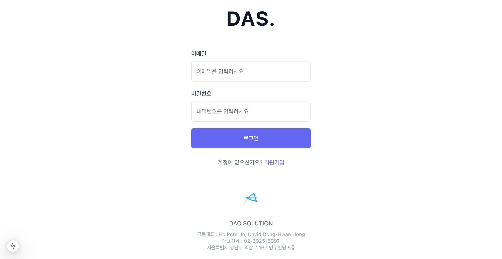

The login page displays:
- Email input field (이메일)
- Password input field (비밀번호)
- Login button (로그인)
- Link to signup page (회원가입)

#### Step 2: Navigate to Signup

Click on the **"회원가입"** (Sign Up) link to create a new account.

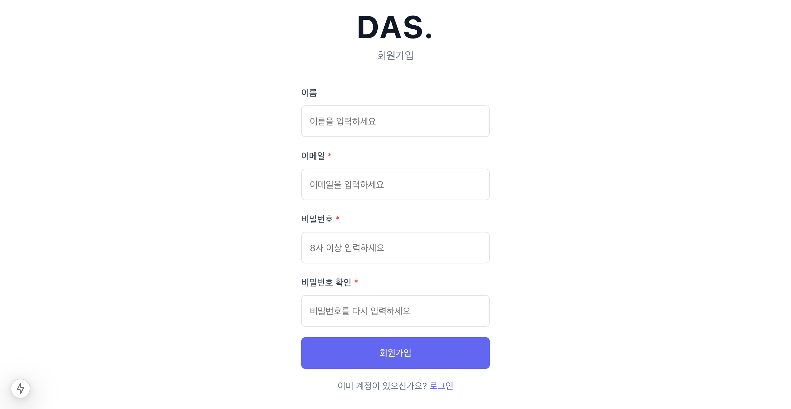

The signup page includes fields for:
- **Name** (이름) - Optional
- **Email** (이메일) - Required*
- **Password** (비밀번호) - Required* (minimum 8 characters)
- **Confirm Password** (비밀번호 확인) - Required*

#### Step 3: Fill in Your Information

Enter your details in the signup form:

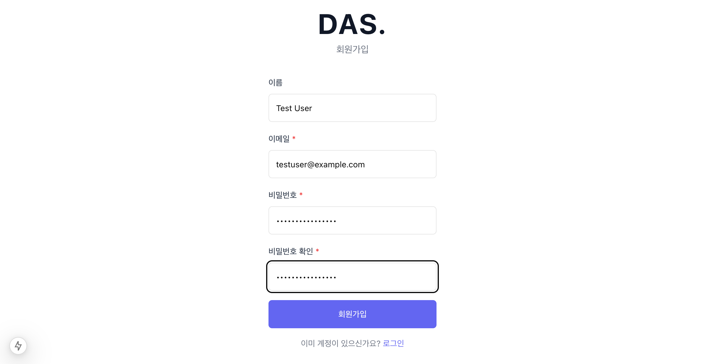

**Requirements:**
- Email must be a valid email address
- Password must be at least 8 characters long
- Passwords must match

#### Step 4: Submit Registration

Click the **"회원가입"** (Sign Up) button to create your account.

---

### Terms and Conditions

After signing up, you'll be directed to accept the terms of service.

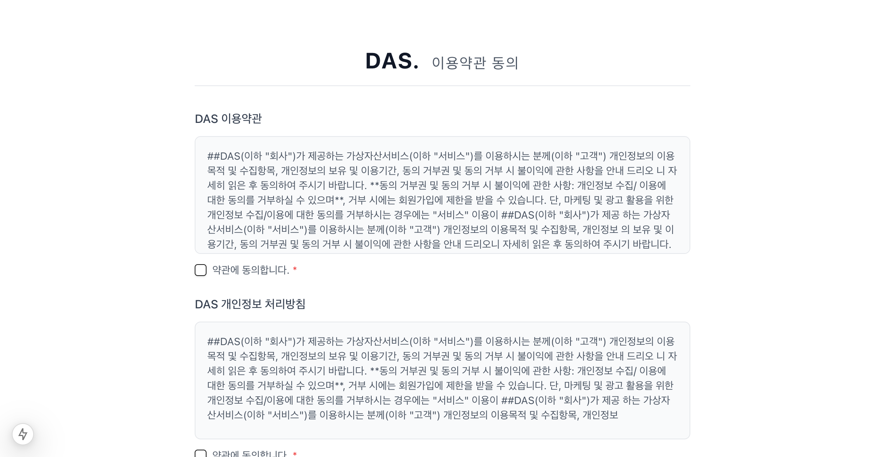

You must agree to three terms:
1. **DAS 이용약관** - DAS Terms of Service
2. **DAS 개인정보 처리방침** - DAS Privacy Policy
3. **DAS. 멤버쉽 유료 약관** - DAS Membership Payment Terms

#### Accept All Terms

You can either:
- Check each box individually, or
- Check the **"전체 약관에 동의합니다"** (Agree to All Terms) checkbox

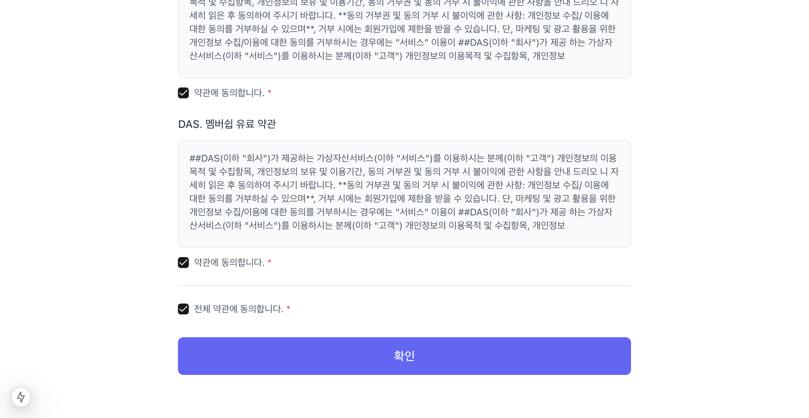

Once all terms are accepted, the **"확인"** (Confirm) button becomes enabled. Click it to proceed.

---

### Setting Up Your Wallet

After accepting the terms, you'll be prompted to set up your blockchain wallet.

#### Step 1: Wallet Introduction

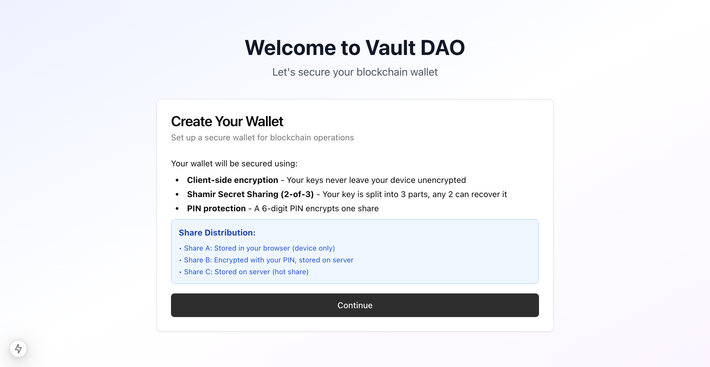

The introduction explains the security features:
- **Client-side encryption** - Your keys never leave your device unencrypted
- **Shamir Secret Sharing (2-of-3)** - Your key is split into 3 parts; any 2 can recover it
- **PIN protection** - A 6-digit PIN encrypts one share

**Share Distribution:**
- **Share A**: Stored in your browser (device only)
- **Share B**: Encrypted with your PIN, stored on server
- **Share C**: Stored on server (hot share)

Click **"Continue"** to proceed.

#### Step 2: Set Your PIN

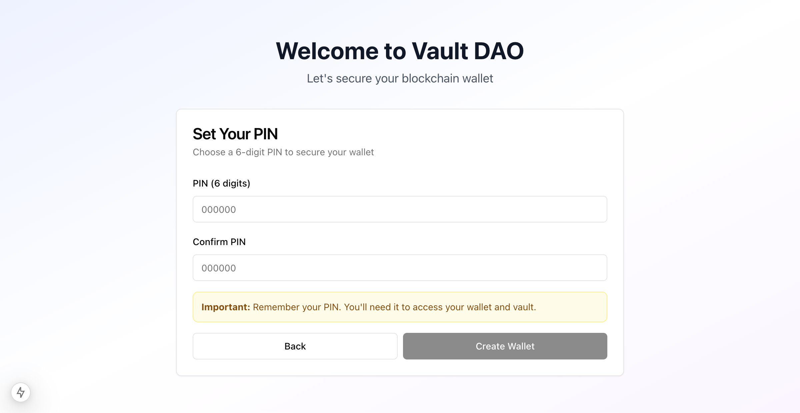

Choose a 6-digit PIN to secure your wallet:

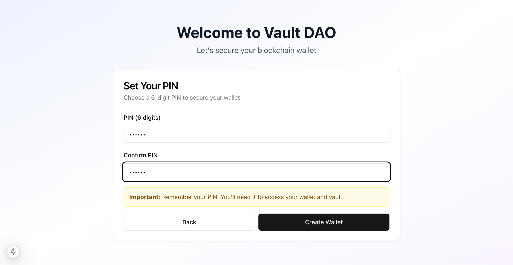

**Important Notes:**
- Remember your PIN - you'll need it to access your wallet and vault
- The PIN is used to encrypt one of your wallet key shares
- Without your PIN, you can only recover your wallet if you have Share A and Share C

Click **"Create Wallet"** to generate your blockchain wallet.

---

## Dashboard Overview

After wallet setup is complete, you'll arrive at the main dashboard.

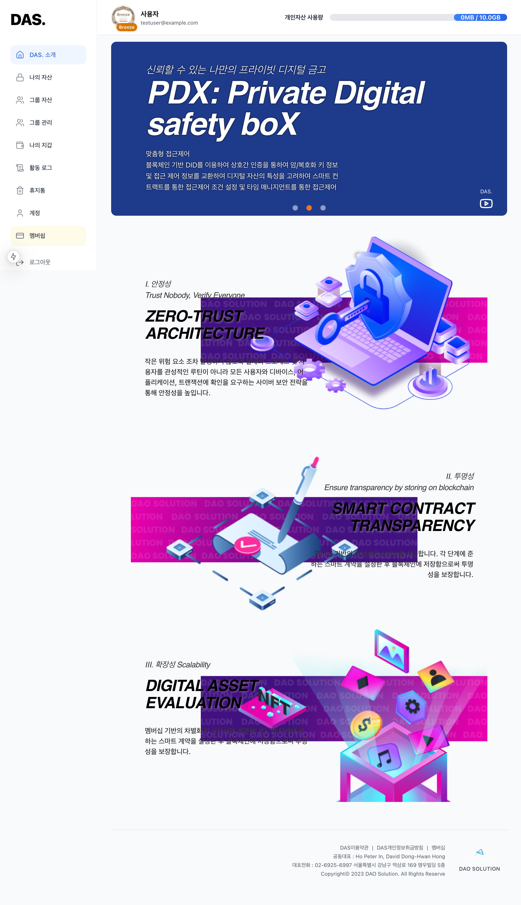

### Navigation Menu

The left sidebar provides access to all main features:

1. **DAS. 소개** (Dashboard) - Platform introduction and overview
2. **나의 자산** (My Assets) - Your personal file vault
3. **그룹 자산** (Group Assets) - Shared group vaults
4. **그룹 관리** (Group Management) - Create and manage groups
5. **나의 지갑** (My Wallet) - Blockchain wallet management
6. **활동 로그** (Activity Log) - View all activities and transactions
7. **휴지통** (Recycle Bin) - Recover deleted files
8. **계정** (Account) - Account settings and security
9. **멤버쉽** (Membership) - Upgrade your plan

### User Profile

The top right section displays:
- **Membership Level**: Bronze, Silver, Gold, or Platinum
- **Email Address**: Your registered email
- **Storage Usage**: Current usage / Total available storage (e.g., 0MB / 10.0GB)
- **Logout Button** (로그아웃)

### Dashboard Content

The main dashboard provides information about:
- **Zero-Trust Architecture**: The security principles behind the platform
- **Private Digital Safety Box (PDX)**: Custom access control features
- **DAS Technology**: Quantum-safe encryption technology

---

## My Assets - Personal Vault

Access your personal file vault by clicking **"나의 자산"** (My Assets).

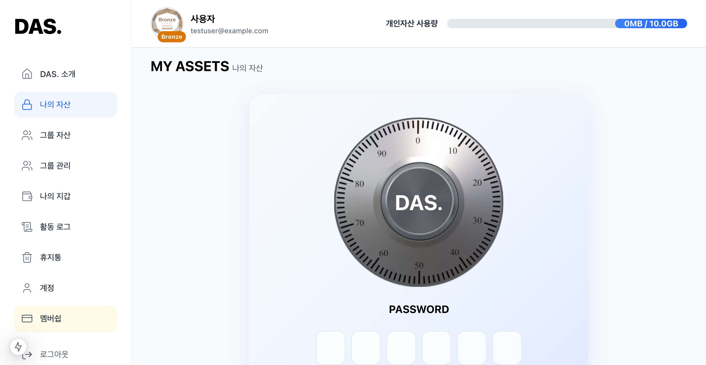

### Vault Password

Your personal vault is protected by a 6-digit password (separate from your wallet PIN). This adds an additional layer of security for your stored files.

**First-time Setup:**
- If you haven't set a vault password yet, you'll need to create one
- Navigate to **"계정"** (Account) → **"비밀번호"** (Password) to set up your vault password

### Opening Your Vault

1. Enter your 6-digit vault password in the dial interface
2. Click **"금고열기"** (Open Vault)
3. Your files and folders will be displayed

**Password Recovery:**
- If you forget your vault password, go to **"마이페이지/비밀번호관리"** (My Page/Password Management)
- Follow the guided recovery procedure

---

## My Wallet - Blockchain Wallet

Manage your blockchain wallet and digital assets by clicking **"나의 지갑"** (My Wallet).

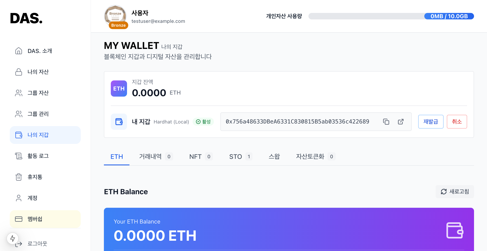

### Wallet Overview

**Displayed Information:**
- **ETH Balance**: Your current Ethereum balance
- **Wallet Address**: Your unique blockchain address (e.g., 0x756a48633DBeA6331C830815B5ab03536c422689)
- **Network**: Current blockchain network (Hardhat Local for development)
- **Chain ID**: Network identifier (1337 for local Hardhat)
- **RPC URL**: Blockchain node endpoint (localhost:8545)

### Wallet Actions

**Copy Address Button** (주소 복사):
- Quickly copy your wallet address to clipboard
- Use this address to receive cryptocurrency

**View in Explorer** (탐색기에서 보기):
- Opens your wallet in the blockchain explorer
- View your transaction history and balance

**Reissue** (재발급):
- Generate a new wallet address if needed
- Use with caution - transfers assets from old to new wallet

**Test ETH** (테스트 ETH 받기):
- In development mode, receive 10 test ETH
- Use for testing transactions and features

### Wallet Tabs

The My Wallet page includes multiple tabs for managing different types of digital assets:

#### ETH Tab

The default tab showing your Ethereum balance:
- **Balance Display**: Shows your current ETH balance
- **Refresh Button** (새로고침): Update your balance from the blockchain
- **Network Information**: Displays current network, Chain ID, and RPC URL
- **Test ETH Button**: Get 10 test ETH for development/testing

#### Transaction History Tab

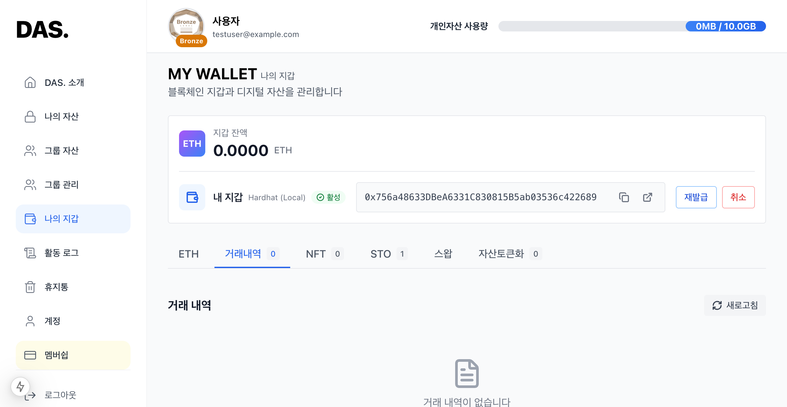

View all your blockchain transactions:
- **Transaction List**: All incoming and outgoing transfers
- **Transaction Details**: Amount, date, from/to addresses, status
- **Refresh Button**: Update transaction history
- **Empty State**: Shows "거래 내역이 없습니다" when no transactions exist

#### NFT Tab

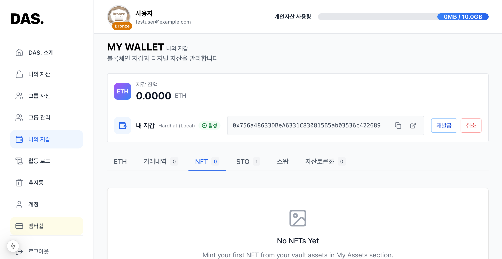

Manage your Non-Fungible Tokens:
- **NFT Gallery**: Visual display of your NFT collection
- **Mint NFTs**: Create NFTs from vault assets
- **Empty State**: "No NFTs Yet" with instructions to mint from My Assets section
- **NFT Details**: View metadata, ownership, and history

#### STO Tab (Security Token Offering)

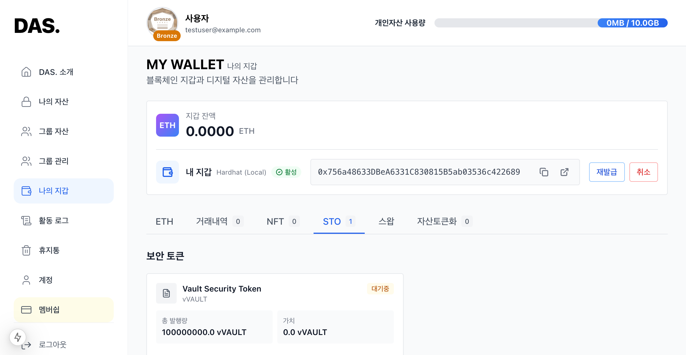

Manage security tokens and tokenized securities:
- **Vault Security Token (vVAULT)**: The platform's native security token
- **Token Status**: Shows current status (대기중 = Pending, 활성 = Active)
- **Total Supply**: 100,000,000.0 vVAULT tokens
- **Your Balance**: Amount of vVAULT tokens you own
- **Token Details**: View token economics and smart contract information

**About vVAULT Token:**
- Used for paying tokenization fees
- Required for asset tokenization transactions
- Can be obtained by swapping ETH

#### Swap Tab

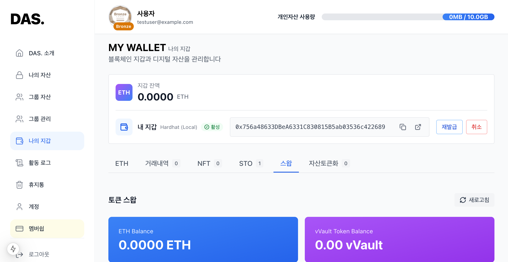

Exchange between ETH and vVault tokens:

**Features:**
- **Swap Direction Toggle**:
  - ETH → vVault: Convert ETH to vVault tokens
  - vVault → ETH: Convert vVault tokens back to ETH
- **Exchange Rate**: 1 ETH = 1000 vVault tokens
- **Amount Input**: Enter the amount you want to swap
- **Estimated Receive**: Shows how much you'll receive
- **Balance Display**: Shows both ETH and vVault balances
- **Refresh Button**: Update current balances

**How to Swap:**
1. Choose swap direction (ETH → vVault or vVault → ETH)
2. Enter the amount you want to swap
3. Review the estimated receive amount
4. Click **"스왑 실행"** (Execute Swap)
5. Confirm the transaction

**Important Note:**
> vVault tokens are used for asset tokenization fees. Acquire vVault tokens before attempting to tokenize real-world assets.

#### Asset Tokenization Tab

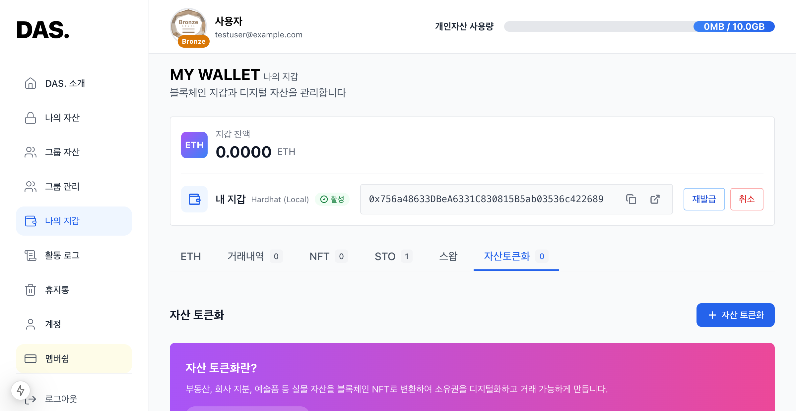

Convert real-world assets into blockchain NFTs:

**What is Asset Tokenization?**
Tokenization transforms physical assets (real estate, company shares, artwork, etc.) into blockchain-based NFTs, creating digital ownership certificates that are:
- Tradeable on blockchain
- Divisible (fractional ownership possible)
- Transparent (ownership history recorded)
- Secure (blockchain-protected)

**Tokenization Process:**
1. Click **"자산 토큰화"** (Tokenize Asset) or **"첫 자산 토큰화하기"** (Tokenize First Asset)
2. Provide asset details (name, description, valuation)
3. Upload supporting documents
4. Pay tokenization fee (100.0 vVAULT)
5. Blockchain records the asset as an NFT
6. Receive digital ownership certificate

**Tokenization Fee:**
- **Cost**: 100.0 vVAULT tokens per asset
- **Purpose**: Covers blockchain transaction costs and platform services
- **Requirement**: Must have sufficient vVault balance before tokenizing

**Tokenized Asset Management:**
- View all your tokenized assets in this tab
- Track asset value and ownership history
- Transfer ownership to other users
- View blockchain transaction records

**Empty State:**
When you haven't tokenized any assets yet:
- "토큰화된 자산이 없습니다" (No tokenized assets)
- Instructions to tokenize your first real-world asset
- Button to start the tokenization process

---

## Group Management

Create and manage collaborative groups by clicking **"그룹 관리"** (Group Management).

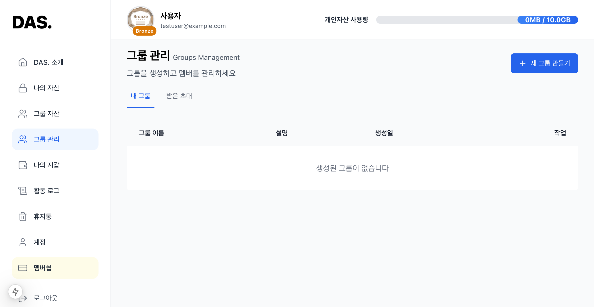

### Group Tabs

**내 그룹** (My Groups):
- View all groups you've created
- Manage group members and permissions

**받은 초대** (Received Invitations):
- View group invitations from other users
- Accept or decline invitations

### Creating a New Group

Click the **"새 그룹 만들기"** (Create New Group) button.

**Group Creation Form:**
1. **그룹 이름*** (Group Name) - Required
   - Enter a descriptive name for your group
   - Example: "Marketing Team" or "Project Alpha"

2. **설명** (Description) - Optional
   - Provide additional context about the group's purpose
   - Helps members understand the group's function

3. Click **"만들기"** (Create) to finalize the group
4. Click **"취소"** (Cancel) to abort

### Group Features

Once created, groups provide:
- **Shared Vault**: Store files accessible to all members
- **Member Management**: Invite and remove members
- **Access Control**: Set permissions for different members
- **Activity Tracking**: Monitor group activities and file access

---

## Group Assets

Access shared group vaults by clicking **"그룹 자산"** (Group Assets).

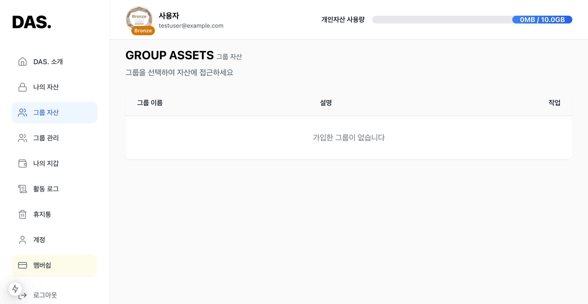

### Accessing Group Vaults

**No Groups Yet:**
- If you haven't joined any groups, you'll see the message: **"가입한 그룹이 없습니다"** (No groups joined)
- Create a group in **Group Management** or accept an invitation

**With Groups:**
- Select a group from the list
- Enter the group's vault password
- Access shared files and folders

### Group Vault Features

- **Collaborative Storage**: Share files with team members
- **Version Control**: Track file changes and updates
- **Permission Levels**: Different access rights for members
- **Group Activity Log**: Monitor who accessed what and when

---

## Activity Logs

Track all your activities and blockchain transactions by clicking **"활동 로그"** (Activity Log).

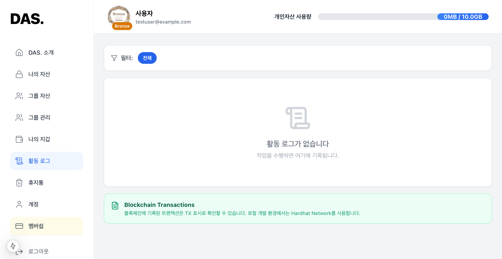

### Log Features

**Filter Options:**
- **전체** (All) - View all activity types
- Filter by specific activity categories

**Activity Types:**
- File uploads and downloads
- Vault access
- Group activities
- Wallet transactions
- Account changes

**Blockchain Transactions:**
- Activities marked with **TX** indicator are recorded on the blockchain
- These transactions are immutable and transparent
- In development, uses Hardhat Network

**Empty State:**
- New accounts show: **"활동 로그가 없습니다"** (No activity logs)
- Activities appear here as you use the platform

---

## Recycle Bin

Recover deleted files or permanently remove them by clicking **"휴지통"** (Recycle Bin).

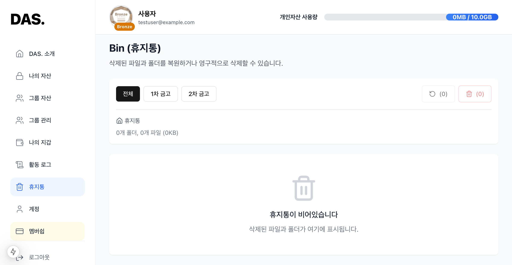

### Bin Categories

**전체** (All):
- View all deleted items from both vaults

**1차 금고** (Primary Vault):
- Items deleted from your personal vault

**2차 금고** (Secondary Vault):
- Items deleted from group vaults

### Bin Actions

**Restore**:
- Recover deleted files back to their original location
- Files maintain their original metadata

**Permanent Delete**:
- Permanently remove files from the system
- This action cannot be undone

**Empty Recycle Bin**:
- Clear all items from the recycle bin
- Frees up storage space

### Storage Information

The bin displays:
- Number of folders
- Number of files
- Total size in KB/MB/GB

---

## Account Settings

Manage your profile and security settings by clicking **"계정"** (Account).

### Profile Tab

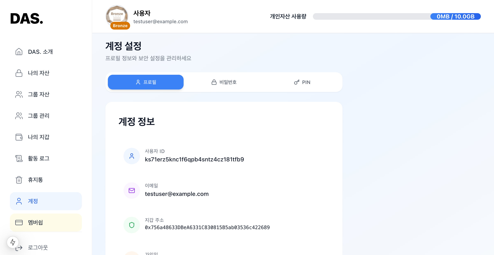

View your account information:
- **사용자 ID** (User ID): Unique identifier for your account
- **이메일** (Email): Your registered email address
- **지갑 주소** (Wallet Address): Your blockchain wallet address
- **가입일** (Join Date): Account creation date

### Password Tab

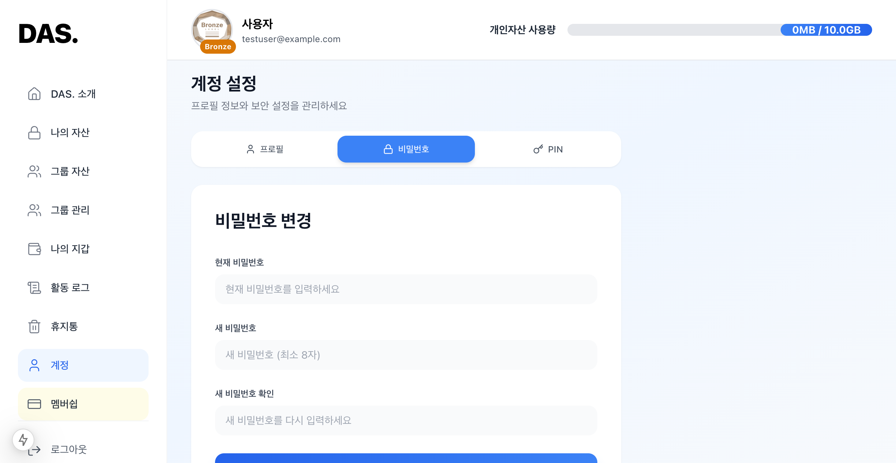

Change your account password:

1. **현재 비밀번호** (Current Password)
   - Enter your existing password

2. **새 비밀번호** (New Password)
   - Must be at least 8 characters
   - Should include a mix of letters, numbers, and symbols

3. **새 비밀번호 확인** (Confirm New Password)
   - Re-enter your new password for verification

4. Click **"비밀번호 변경"** (Change Password) to save

### PIN Tab

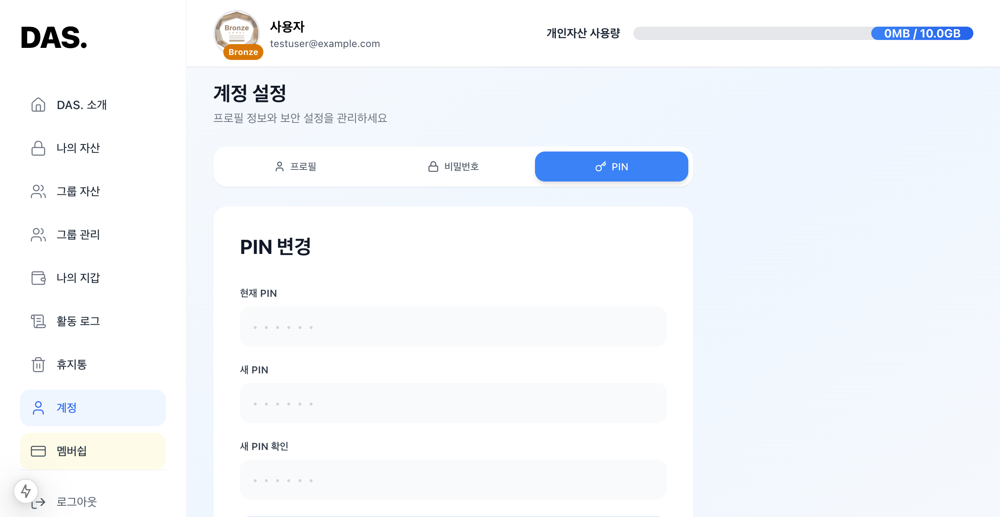

Change your wallet PIN:

**PIN Change Form:**
1. **현재 PIN** (Current PIN)
   - Enter your existing 6-digit PIN

2. **새 PIN** (New PIN)
   - Choose a new 6-digit PIN

3. **새 PIN 확인** (Confirm New PIN)
   - Re-enter your new PIN

**Important Security Note:**
> 🔐 PIN을 변경하면 지갑 키가 새 PIN으로 다시 암호화됩니다
>
> (Changing your PIN will re-encrypt your wallet key with the new PIN)

**PIN Recovery:**
- Click **"PIN을 잊으셨나요? 🔑"** (Forgot PIN?)
- If browser data is preserved, recovery is possible without PIN
- Uses Share A (stored in browser) and Share C (on server)

---

## Membership Plans

Upgrade your storage and features by clicking **"멤버쉽"** (Membership).

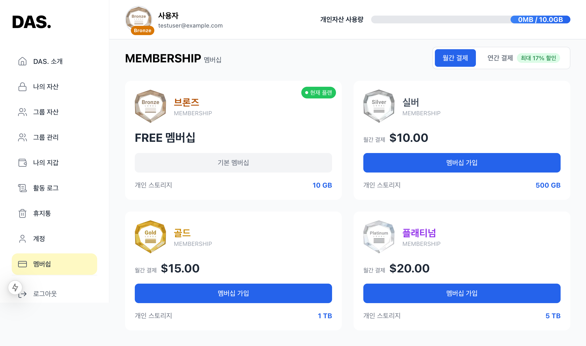

### Available Plans

#### 🥉 Bronze (FREE)
- **Price**: FREE
- **Storage**: 10 GB
- **Status**: Default membership for all new users
- **Features**: Basic access to all platform features

#### 🥈 Silver
- **Price**: $10.00/month (or annual with discount)
- **Storage**: 500 GB
- **Features**:
  - Increased storage capacity
  - Priority support
  - Advanced features

#### 🥇 Gold
- **Price**: $15.00/month (or annual with discount)
- **Storage**: 1 TB
- **Features**:
  - Large storage capacity
  - Premium support
  - All advanced features
  - Group priority

#### 💎 Platinum
- **Price**: $20.00/month (or annual with discount)
- **Storage**: 5 TB
- **Features**:
  - Maximum storage capacity
  - Dedicated support
  - All premium features
  - API access
  - Custom integrations

### Payment Options

**월간 결제** (Monthly Payment):
- Pay month-by-month
- Cancel anytime
- No long-term commitment

**연간 결제** (Annual Payment):
- **최대 17% 할인** (Up to 17% discount)
- Pay once per year
- Best value for money
- Annual commitment

### Upgrading Your Plan

1. Choose your desired membership tier
2. Click **"멤버십 가입"** (Join Membership)
3. Complete payment process
4. Your storage and features will be upgraded immediately

---

## Security Best Practices

### Wallet Security

1. **Remember Your PIN**:
   - Write it down and store it securely offline
   - Don't share it with anyone
   - Don't store it in digital format

2. **Backup Your Wallet**:
   - Ensure Share A remains in your browser
   - Keep your PIN secure for Share B access
   - The platform maintains Share C

3. **2-of-3 Recovery**:
   - You need any 2 shares to recover your wallet
   - Losing your PIN doesn't mean losing your wallet
   - Browser data preservation helps with recovery

### Vault Security

1. **Separate Passwords**:
   - Use different passwords for account, vault, and PIN
   - Don't reuse passwords across services

2. **Regular Password Changes**:
   - Update your vault password periodically
   - Use strong, complex passwords

3. **Monitor Activity Logs**:
   - Regularly check your activity logs
   - Report any suspicious activities immediately

### Data Security

1. **Client-Side Encryption**:
   - All files are encrypted before upload
   - Encryption keys never leave your device unencrypted

2. **Zero-Trust Architecture**:
   - Platform doesn't trust any process by default
   - Every action requires verification

3. **Blockchain Transparency**:
   - Major activities are recorded on blockchain
   - Immutable audit trail of all transactions

---

## Troubleshooting

### Can't Login?

**Check:**
- Email address is correct
- Password is correct (case-sensitive)
- Account has been verified

**Solutions:**
- Use password reset feature
- Check your email for verification link
- Contact support if issues persist

### Forgot Your PIN?

**If Browser Data is Preserved:**
1. Click "PIN을 잊으셨나요?" on PIN change page
2. System will use Share A (browser) + Share C (server)
3. Set a new PIN

**If Browser Data is Lost:**
- Contact support with your account details
- Recovery process may take longer
- Additional verification may be required

### Forgot Vault Password?

1. Go to Account Settings → Password
2. Click password recovery link
3. Follow the verification process
4. Set a new vault password

### Files Not Uploading?

**Check:**
- Storage quota not exceeded
- File size within limits
- Network connection is stable
- Vault is unlocked

**Solutions:**
- Free up storage space
- Split large files
- Retry upload
- Contact support for persistent issues

### Wallet Balance Not Showing?

**Development Environment:**
- Ensure Hardhat Network is running
- Click "새로고침" (Refresh) button
- Use "테스트 ETH 받기" to get test funds

**Check:**
- Network connection
- Blockchain node status
- Wallet synchronization

---

## Support and Resources

### Getting Help

- **Email**: support@daosolution.io
- **Phone**: 02-6925-6997
- **Address**: 서울특별시 강남구 역삼로 169 명우빌딩 5층

### Documentation

- Terms of Service: Available at login
- Privacy Policy: Available at signup
- Membership Terms: Available in membership section

### Company Information

**DAO SOLUTION**
- **Representatives**: Ho Peter In, David Dong-Hwan Hong
- **Copyright**: © 2023 DAO Solution. All Rights Reserved
- **Website**: https://daosolution.io/

---

## Glossary

**DAS**: Digital Asset Security - The platform's security framework

**Shamir Secret Sharing**: A cryptographic method to split a secret into multiple shares

**Zero-Trust Architecture**: Security model that doesn't trust any user or process by default

**Blockchain**: Distributed ledger technology for transparent transaction recording

**Smart Contract**: Self-executing contract with terms directly written into code

**ETH**: Ethereum - The cryptocurrency used on the Ethereum blockchain

**NFT**: Non-Fungible Token - Unique digital assets on blockchain

**STO**: Security Token Offering - Blockchain-based securities

**Vault**: Secure storage area for digital assets

**PIN**: Personal Identification Number - 6 digits for wallet security

**RPC**: Remote Procedure Call - Interface to interact with blockchain

**Chain ID**: Unique identifier for a blockchain network

---

## Conclusion

Vault DAO provides a secure, decentralized platform for managing your digital assets. By combining blockchain technology with client-side encryption and zero-trust architecture, your data remains secure and under your control.

**Key Takeaways:**
- Always keep your PIN and passwords secure
- Regularly monitor your activity logs
- Understand the 2-of-3 wallet recovery system
- Start with Bronze membership and upgrade as needed
- Use groups for collaborative work

Welcome to Vault DAO - Your secure digital asset platform!
